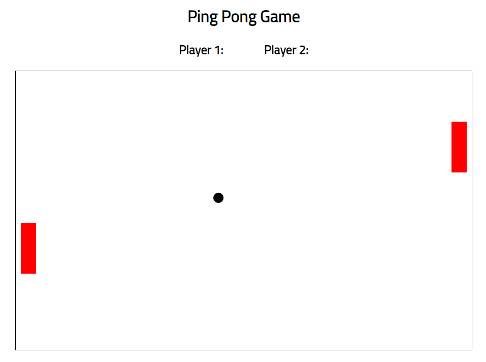

## Table of contents
* [General info](#general-info)
* [Technologies](#technologies)
* [Screen](#screen)
* [Live](#live-star2)
* [Source](#source)

## General info
Ping Pong Game. Game developed for two players.

## Technologies
Project was created with:
* HTML5
* CSS3
* JavaScript

## Screen
 

## Live :star2:
https://goldipl.github.io/PingPongGame/

## Source
Source code ©[MarcinMoskala](https://github.com/MarcinMoskala) from book "Javascript od podstaw".   
Code upgraded by me :)